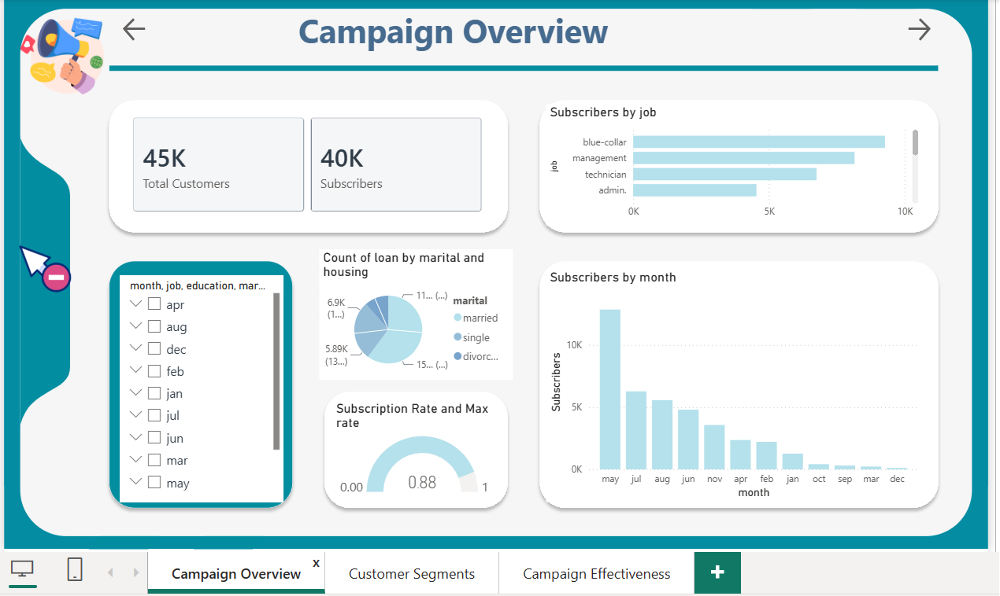
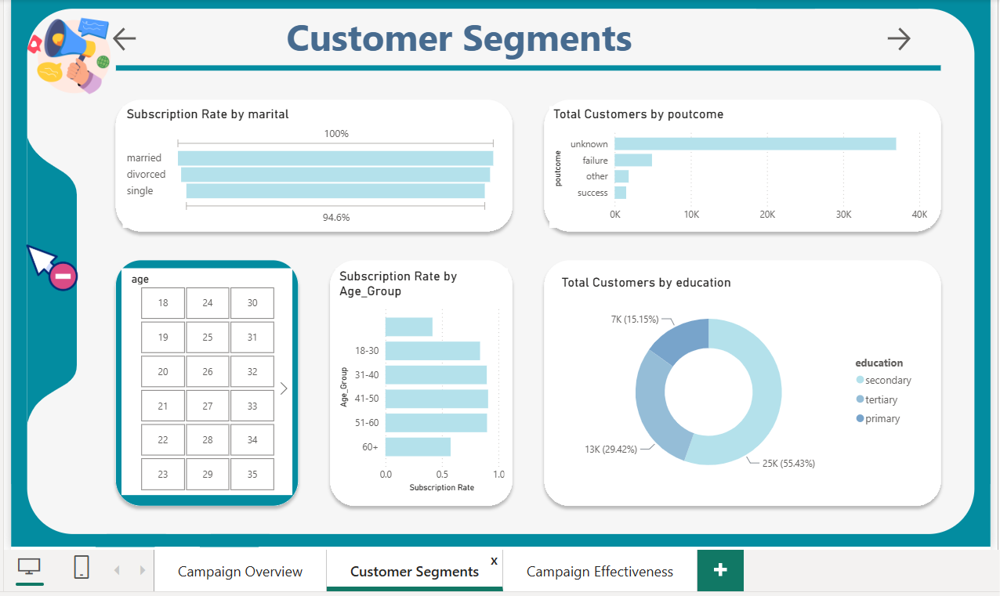
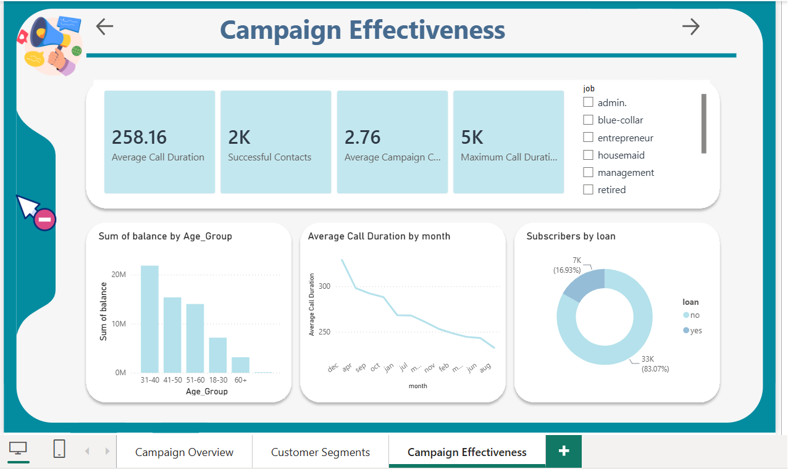

# 🏦 Bank Marketing & Customer Behavior Analysis


A complete end-to-end Data Analytics and Machine Learning project developed as part of the NTI Data Analytics Program.

The project analyzes customer behavior in direct marketing campaigns, identifies the factors that influence term deposit subscriptions, and builds predictive machine learning models to support data-driven marketing decisions.


## 📌 Project Overview

This project analyzes customer behavior in a bank direct marketing campaign using data analytics, visualization, and machine learning techniques.

The primary objective is to identify the key factors that influence whether a customer subscribes to a term deposit. The project includes data preprocessing, exploratory data analysis (EDA), feature engineering, predictive modeling, and an interactive Power BI dashboard to transform raw data into actionable business insights.

The final solution helps marketing teams better understand customer behavior, improve campaign effectiveness, and support data-driven decision-making.

## 🎯 Business Problem

Bank telemarketing campaigns often suffer from low conversion rates because every customer is contacted without considering their likelihood of subscribing. This approach increases operational costs, consumes valuable agent time, and may negatively affect customer experience.

The goal of this project is to identify the demographic, financial, and campaign-related factors that influence customer subscription decisions. By applying data analytics and machine learning techniques, the project helps prioritize high-potential customers and supports more effective, data-driven marketing strategies.

## 📊 Dataset

The project uses the **Bank Marketing & Customer Behavior** dataset from Kaggle. Each record represents a customer contacted during a direct marketing campaign for a bank term deposit product.

The dataset contains demographic information, financial details, campaign-related attributes, and the target variable indicating whether the customer subscribed to the term deposit.

**Dataset Size**
- 45,211 records
- 17 features

## ⚙️ Project Workflow

The project was completed through the following stages:

1. Data Cleaning & Preprocessing
2. Exploratory Data Analysis (EDA)
3. Feature Engineering
4. Machine Learning Modeling
5. Model Evaluation
6. Interactive Power BI Dashboard
7. Business Insights & Recommendations

8. ## 🧹 Data Cleaning & Preprocessing

Several preprocessing steps were applied before building the predictive models:

- Renamed generic column names with meaningful business labels.
- Verified and removed duplicate records.
- Preserved "unknown" categorical values to maintain the original data distribution.
- Examined numerical outliers and retained legitimate business observations.
- Applied One-Hot Encoding for categorical variables.
- Converted the target variable into binary values.
- Created an additional **Age_Group** feature for customer segmentation.

  ## 📈 Exploratory Data Analysis (EDA)

The exploratory analysis focused on understanding customer behavior and identifying patterns related to term deposit subscriptions.

Key analyses included:

- Target variable distribution
- Subscription rate by customer job
- Subscription rate by education level
- Subscription rate by marital status
- Call duration vs. subscription outcome
- Correlation heatmap
- Monthly subscription trends

The analysis revealed that customer demographics, previous campaign interactions, and call duration play an important role in predicting subscription outcomes.

## 🤖 Machine Learning

Two supervised classification models were developed and compared:

- Logistic Regression
- Random Forest Classifier

Both models were trained using a stratified train/test split to preserve the original class distribution.

The evaluation included:

- Accuracy
- Precision
- Recall
- F1-Score
- ROC-AUC
- Confusion Matrix

## 📊 Power BI Dashboard

An interactive Power BI dashboard was developed to help stakeholders explore customer behavior and campaign performance.

The dashboard includes:

- Campaign Overview
- Customer Segments
- Campaign Effectiveness

Interactive filters and KPI cards allow users to explore the data from multiple perspectives and support business decision-making.

## 💡 Key Business Insights

- Customer characteristics significantly influence subscription behavior.
- Longer call durations are generally associated with higher subscription rates.
- Previous successful campaign interactions improve future conversion probability.
- Customer segmentation can improve marketing efficiency.
- Predictive modeling enables better targeting and resource allocation.

  ## 🛠️ Technologies Used

- Python
- Pandas
- NumPy
- Matplotlib
- Scikit-learn
- Power BI
- Jupyter Notebook

  ## 📂 Repository Structure

```text
.
├── README.md
├── bank-marketing-customer-behavior.ipynb
├── bank_marketing_cleaned.csv
├── Bank_Marketing_Dashboard.pbix
├── Bank_Marketing_Final_Report.docx
└── Bank-Marketing-and-Customer-Behavior.pptx
```

## 🚀 Future Improvements

Future work may include:

- Testing additional machine learning algorithms such as XGBoost and LightGBM.
- Performing hyperparameter tuning to improve model performance.
- Deploying the predictive model as a web application.
- Integrating real-time prediction into marketing workflows.
- Expanding the dashboard with additional KPIs and business metrics.

## 📷 Dashboard Preview

### Campaign Overview



### Customer Segments



### Campaign Effectiveness


